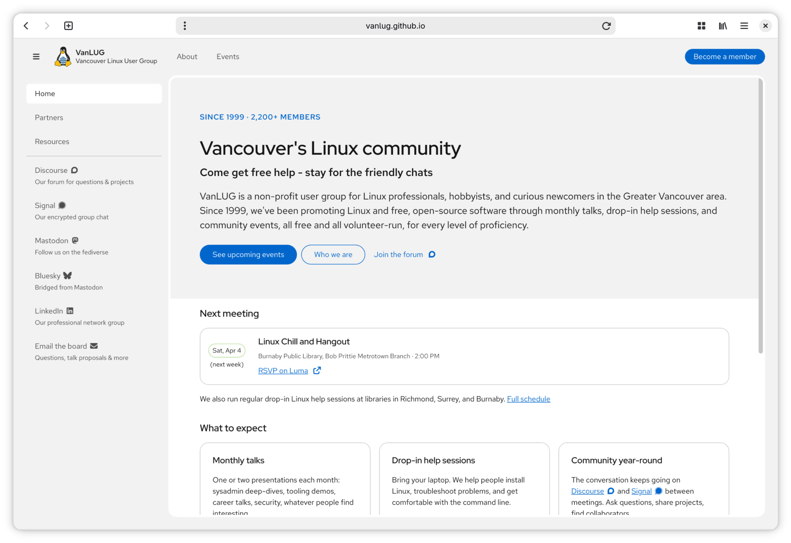
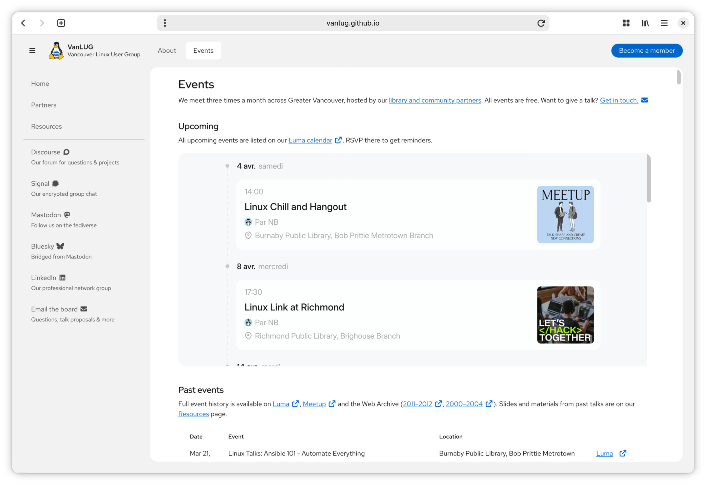
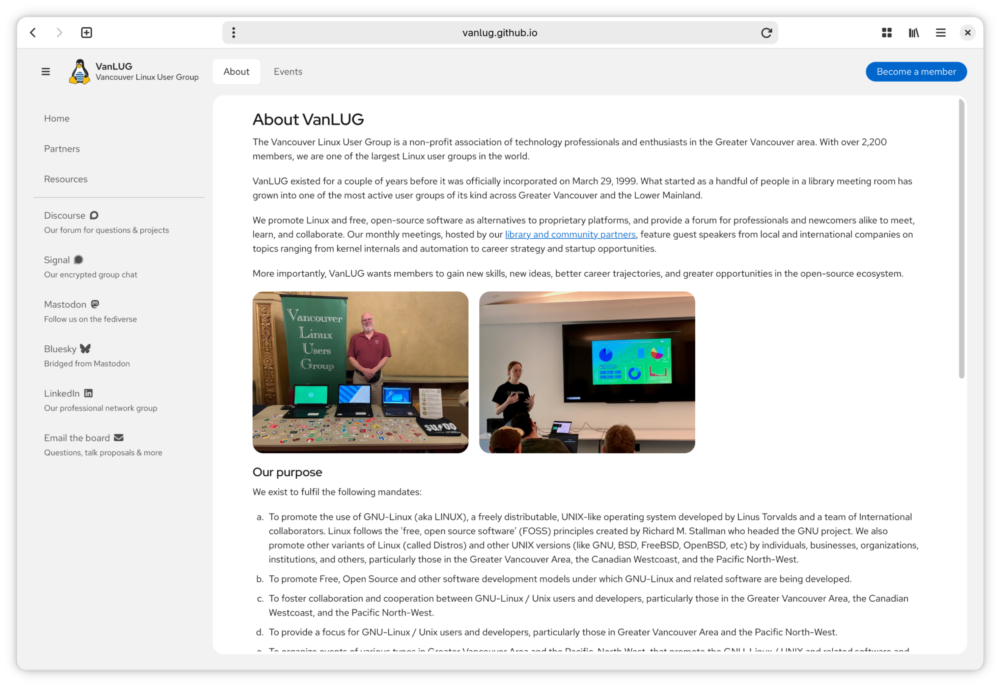
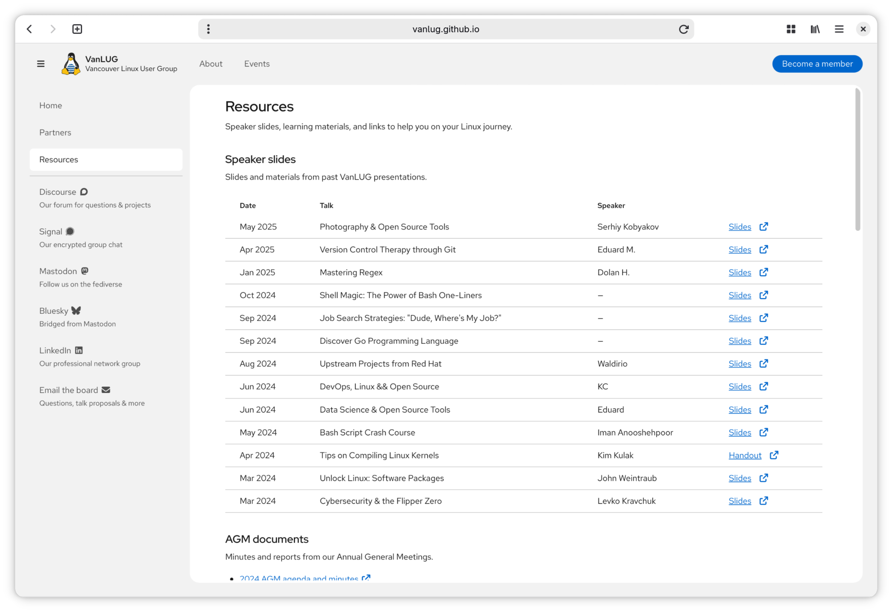
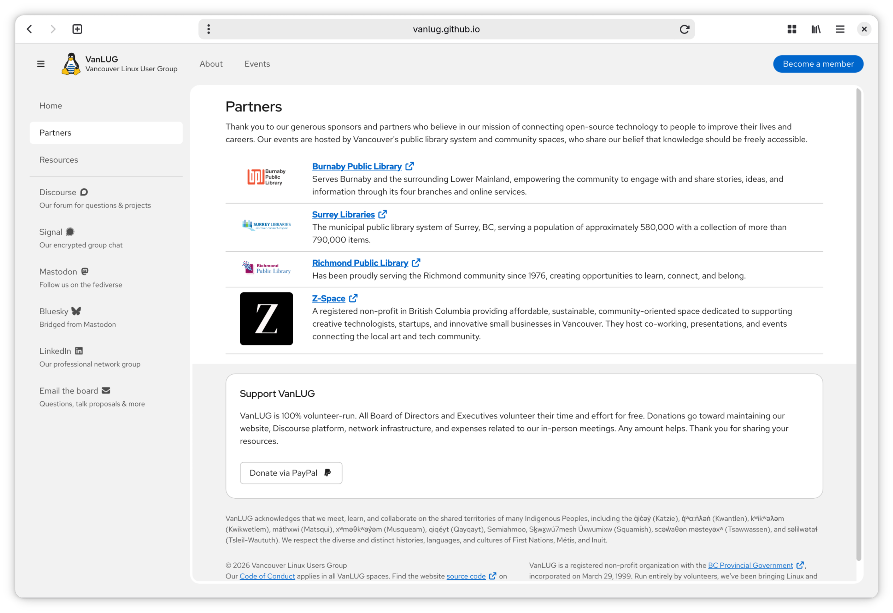
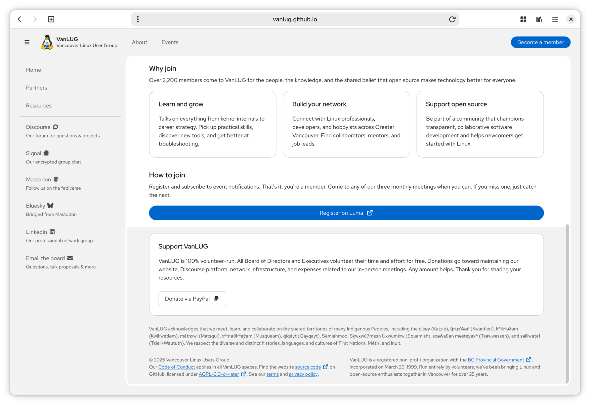

# vanlug.ca

Website for the Vancouver Linux Users Group.

[](https://github.com/vanlug/vanlug.github.io/actions/workflows/hugo.yaml)

[](https://pkg.go.dev/github.com/vanlug/vanlug.github.io)

## Overview

VanLUG is a non-profit user group for Linux professionals, hobbyists, and curious newcomers in the Greater Vancouver area, incorporated in 1999. The site is built with Hugo and PatternFly v6.

It provides the following:

- Home page with next meeting card (fetched from Luma API via a proxy hosted on Railway), "what to expect" cards, and social links
- Events page with embedded Luma calendar iframe and full past event history
- About page with mission, purpose mandates, and board of directors
- Partners page listing library and community venue partners
- Resources page with speaker slides, AGM documents, learning links, and design system
- Membership page with benefits and registration link (Luma)
- Code of Conduct, Terms of Service, and Privacy Policy pages
- Donate card and land acknowledgment in the footer

The site is accessible at [https://vanlug.ca/](https://vanlug.ca/).

## Screenshots

Click on an image to see a larger version.

<a display="inline" href="./docs/home.png?raw=true">

</a>

<a display="inline" href="./docs/events.png?raw=true">

</a>

<a display="inline" href="./docs/about.png?raw=true">

</a>

<a display="inline" href="./docs/resources.png?raw=true">

</a>

<a display="inline" href="./docs/partners.png?raw=true">

</a>

<a display="inline" href="./docs/membership.png?raw=true">

</a>

## Acknowledgements

- [gohugoio/hugo](https://github.com/gohugoio/hugo) provides the static site generator.
- The open source [PatternFly design system](https://www.patternfly.org/) provides the UI components.
- [FortAwesome/Font-Awesome](https://github.com/FortAwesome/Font-Awesome) provides the icons.
- [lu.ma](https://lu.ma/) provides the event calendar and API.

## Contributing

To contribute, please use the [GitHub flow](https://guides.github.com/introduction/flow/) and follow our [Code of Conduct](./CODE_OF_CONDUCT.md).

To build the site locally, run:

```shell
$ git clone https://github.com/vanlug/vanlug.github.io.git
$ cd vanlug.github.io
$ npm install
$ hugo server
```

## License

vanlug.ca (c) 2026 Felicitas Pojtinger and contributors

SPDX-License-Identifier: AGPL-3.0
